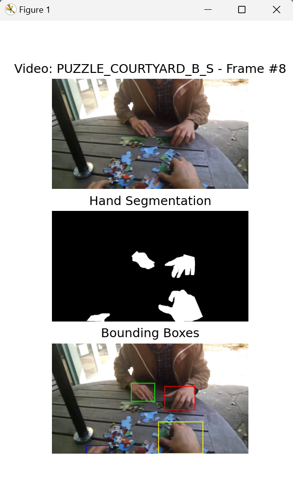
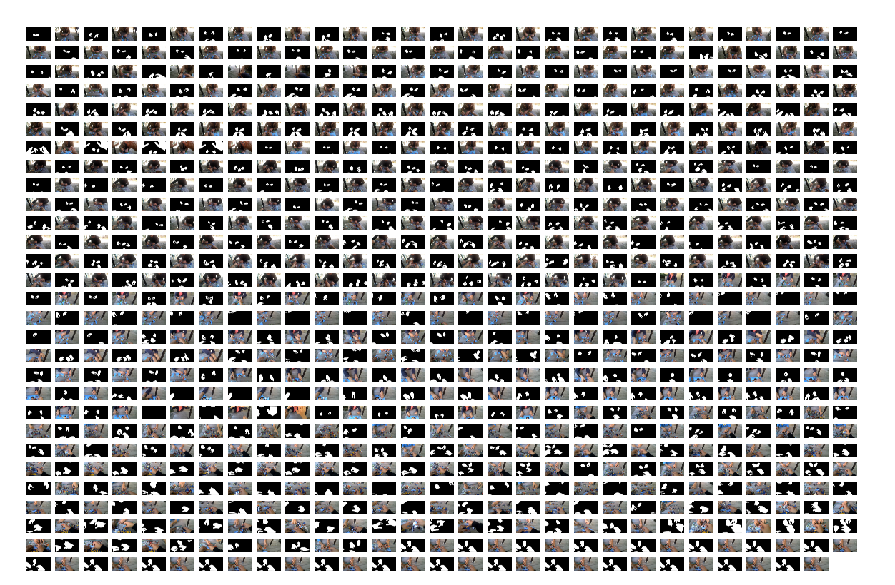
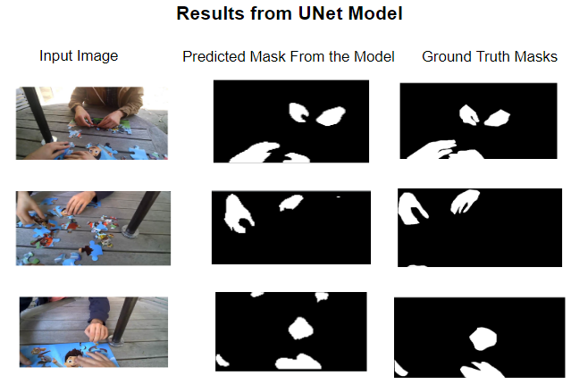

# EgoHands_Dataset

Train and test a hand segmentation model with the UNet architecture by querying over 48 hours of complex first-person interactions from the EgoHands Dataset using filters (location, activity, viewer, partner), and create a PyTorch Database object of respective images and binary hand segmentation labels. Built entirely with Python! 

<table>
<tr>
<td> <b>Sample Run of DEMO1.py</b>
<td><b>Visualizing Images and Segmentation Labels from Sample PyTorch Dataset Object</b>
<td><b>Testing the UNet Model</b>
</tr>
<tr>
<td>  </td>
<td>  </td>
<td>  </td>
</tr></table>


In addition, query bounding boxes, segmentations masks, and base images by frame, and filter through videos as stated.

This project makes it easier for developers to run ML models for hand segmentation and adjust their testing set from the EgoHands Dataset.

## Code Overview

Each file contains a description of what it does. 

`getMetaBy.py`, `getSegmentationMask.py`, `getFramePath.py`, `getBoundingBoxes.py`, and `DEMO1.py` contain (for the most part) the same descriptions as from the original EgoHands MATLAB code. The rest (`getTrainingImgs.py`, `visualizeDataset.py`, `dataset.py`, 'model.py', 'train.py') are fully commented out by myself.

To train and test the UNet model, run the main method in `train.py`. All methods used and referenced include descriptions in the files themeselves. To get a quick overview of what this project can do, run `DEMO1.py` and read the commented out code. To view a sample PyTorch dataset queried from the videos, run `visualizeData.py`.

## Setting Up and Running the Code

### Package Manager and Required Libraries
The following libraries are required for this project. Steps to get set up are below.
- SciPy
- NumPy
- Pandas
- PyTorch
- OpenCV
- Matplotlib
- pathlib

<br>

**Setting Up Environment**
<br>

`conda env create -f config/configurations.yml`

<br> 

**Installing PyTorch**
<br>
To install PyTorch, visit the [installation guide](https://pytorch.org/get-started/locally/). Scroll down and choose your configuration (For a sample run the following options are good enough: Stable, your OS, Python, CPU). In the anaconda prompt, copy, paste, and run the command the website shows you.

<br>

**Changing the Interpreter**
<br>
*Note: this is applicable to most IDEs, but not all*
<br>
In your IDE/Compiler, with your project open, set the interpreter's path to the new environment you just created. To find the path, enter the following in the Anaconda prompt and copy the path with the .exe file from the EgoHandsDataset environment-

For Mac
```
which python
```

For Windows
```
where python
```

### Downloading the EgoHands Labelled Frames from Indiana University
Go to [this link](http://vision.soic.indiana.edu/projects/egohands/) and download the "Labelled Data" Zip Archive (which should be around 1.3GB). Unzip this file and drag the \_LABELLEDSAMPLES\_ folder into the same directory level as the rest of the code.

Now, you should be good to go!

<br>

## Maintainer
Contact me here-
- **shivansh.s@utexas.edu**

## Credit
All videos and raw label data (the EgoHands dataset itself) come from the following paper-
<br>
```
@InProceedings{Bambach_2015_ICCV,
author = {Bambach, Sven and Lee, Stefan and Crandall, David J. and Yu, Chen},
title = {Lending A Hand: Detecting Hands and Recognizing Activities in Complex Egocentric Interactions},
booktitle = {The IEEE International Conference on Computer Vision (ICCV)},
month = {December},
year = {2015}
}
```
<br>

UNet architecture provided under MIT License by [Aladdin Persson](https://github.com/aladdinpersson/Machine-Learning-Collection/blob/master/ML/Pytorch/image_segmentation/semantic_segmentation_unet/model.py)
